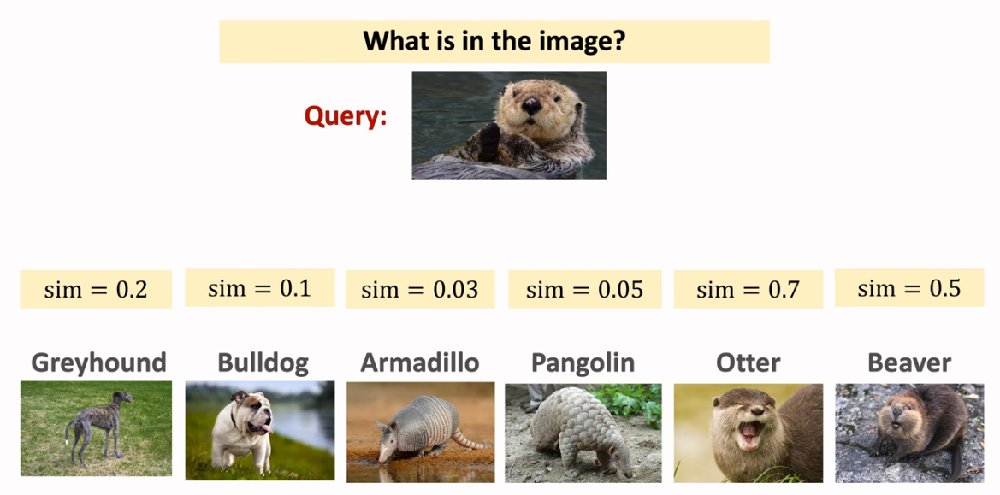

# Meta Learning (few-shot-learning) explained
> - An Introduction and exploration of Meta learning architucture specifically **few-shot-learning**. 
> - Our goal is to be able to classify new objects never seen it in the training data with very few examples.

## Tables of contents
1. [Motivation for Meta learning](#motivation-for-meta-learning)
1. [General idea about few-shot-learning](#few-shot-learnig)
1. [Defining common terms for few-shot-learning](#defining-common-terms-in-few-shot-learnig)
1. [How the model learn ??](#how-the-model-learn)
1. [Diffenrent techniques for training the **similarity function**](./)
1. [Contacts](#contacts)
1. [Rsources](#resources)
1. [License](#license)

## Motivation for Meta learning
> Learning visual models of object categories requires thousands of training examples; this is due to the diversity and richness of object appearance which requires models containing hundreds of parameters.
- Informal observation tells us that Humans can learn a new category of animals both fast and easy
- Human can learn to recognize an animal that they have never seen before by seeing 2 or 3 images of it.
- ***In The other side:*** Computer requires thousands if not tens of thousands of training images to be able to reconize a new category.
- Could computer vision algorithms be similarly efficient?
- One possible explanation of human efficiency is that when learning a new category we take advantage of prior experience.
  - The appearance of the categories we know and, more importantly, the variability in their appearance, gives us important information on what to expect in a new category. This may allow us to learn new categories from few(er) training examples.
- And here we will try to explain how we can **some how** give the copmuter the ability to mimic what Humans do.

---

## Few shot learnig
***Defination:*** Few-shot learning is the problem of making predictions based on a limited number of samples. 
- Few-shot learning is different from standard supervised learning.
  - **The goal of Here** is not to let the model recognize the images in the training set and then generalize to the test set. 
  - Instead, the goal is to learn. **Learn to learn**
- In supervised learnig the goal is to build a model around class recognition.
- So the goal isn't to recognize the cat or dog the goal is to know what is the diffrences between them
- ***In other simple words:*** 
> - The goal is to learn how to measure the similarity and differences between **2 classes**, here we accomplish the **learn to learn**.
> - That's how we can recognize unseen ***categories*** in the training set.
> - (e.g) Training into (Dogs, Cats, and Tigers) classes and then use the same model to recognize a new class like Elephant by providing it with additional information a support set (few shot).
> - We will get to the technical details of how the model can do this later.
> 

---

## Defining common terms in few shot learnig
+ **What is a support set ?**
  - After training the similarity function of our model we want to classify new image **(Query img)**, this image as we know from above doesn't belong to any of our classes so the support set will contain a set of images and at least one of them belong to the same class as the query img, so the model could compute a similarity_score for every img in the support set and pick the highest score as the class of the new img.
    > (e.g) our model has three classes (Cats, dogs, and tigers) and we want to query it using an image of elephant, so we'll need to provide a support set as our  additional info for the model (hence the name few shot, the small dataset) them the model will compare the query img with every single image and will provide similarity score, and we will choose the highest sim_score as our result the below image shows an example of what i did explain.

+ What is this mean **K-way, n-shot, support set (4way-3shots support set)**
  - **k-way:** are the number of classes in the support set, 4way means we have four classes (cat, dog, pegion, elephant).
  - **N-shot:** are the number of samples per class, 3shots means we have a 3 imgs per class in the support set.

---

## Contacts
> You can reach out for me in twitter @amshrbo[twitter.com/amshrbo] or via mail `amshrbo@gmail.com`

## Resources
- You can Watch **Shusen Wang** videos on [YouTube](https://www.youtube.com/playlist?list=PLgtf4d9zHHO8YjSSkkBT55XN8xsIvb-ku).
  - You can find the slides associated with videos [here](https://github.com/wangshusen/DeepLearning) Just go to this repos and search for Meta Learning.
- [One-Shot Learning of Object Categories](https://www.computer.org/csdl/journal/tp/2006/04/i0594/13rRUxC0SXe) Lei Fei-Fei, Fergus, Perona, IEE, 2006
- [Few shot learnig article from Analytics vedhya](https://www.analyticsvidhya.com/blog/2021/05/an-introduction-to-few-shot-learning/)
- [Siamese neural network in wikipedia](https://en.wikipedia.org/wiki/Siamese_neural_network)
- [Siamese Neural Networks for One-Shot Image Recognition](http://www.cs.toronto.edu/~gkoch/files/msc-thesis.pdf)

## License
[GPL-3.0 License](./LICENSE)
